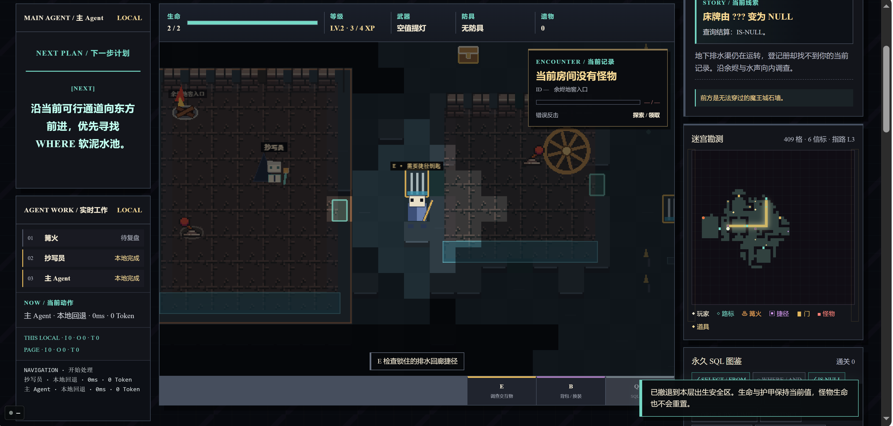
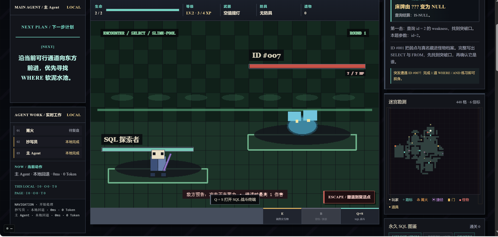
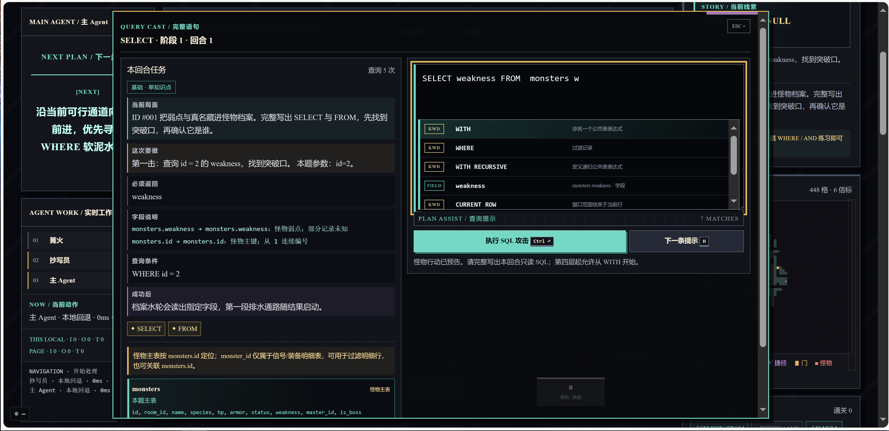

# SELECT * FROM DUNGEON

<div align="center">

<p><a href="https://kkkirito-123.github.io/Select-From-Dungeon/"><strong>Online Demo / 在线试玩</strong></a></p>



### A browser SQL roguelite for learning, exploring, and surviving a living dungeon

<p>
  <a href="game/"></a>
  <a href="LICENSE"></a>
  <a href="game/package.json"></a>
</p>

[简体中文](README.md) | **English**

</div>

## What Is It?

`SELECT * FROM DUNGEON` is an offline-first Chinese browser roguelite where SQL is the combat action. Explore a deterministic pixel labyrinth, meet monsters that reveal only their IDs, and write a complete SQLite query to break their defenses. Correct results become animated attacks; mistakes trigger a readable counterattack and a new clue.

The game runs locally in a browser. No account, database server, or AI service is required. Optional Agent and presence services add companionship and a tab counter, but the core run stays playable without them.

## Screenshots

<div align="center">
  
  
</div>

## Features

- Explore eight deterministic `56x42` floors with fog discovery, a minimap, route guidance, campfires, shortcuts, gates, and physical landmarks.
- Fight with real SQLite WASM queries. Each encounter shows the task, schema, relationships, progressive hints, and the exact result needed to land a hit.
- Learn a staged SQL path from `SELECT` and `WHERE` to joins, subqueries, CTEs, window functions, controlled DML, indexes, and migration concepts.
- Keep a persistent Monster Codex: enemies show a stable ID before defeat, then recover their names on the finishing blow.
- Rest at campfires, set respawn points, review local SQL attempts, manage equipment, and retreat without resetting the run.
- Play with keyboard or touch controls. All run data, mastery, and review records stay in the browser by default.

## The Eight Floors

| Floor | Region | SQL focus |
|---:|---|---|
| 1 | Ember Archive | `SELECT`, `WHERE`, `IS NULL`, `GROUP BY`, `HAVING` |
| 2 | Tidal Archipelago | `ORDER BY`, `LIMIT`, `DISTINCT`, `INNER JOIN`, `LEFT JOIN` |
| 3 | Frost Gravefield | self joins, three-table joins, `UNION`, relationship audits |
| 4 | Elemental Furnace | scalar / `IN` / `EXISTS` / correlated subqueries, CTEs |
| 5 | Black-Iron Order | window functions, partitions, ranking, frames, Top-N |
| 6 | Dragon Ridge Workshop | controlled `INSERT`, `UPDATE`, `DELETE`, transactions, savepoints |
| 7 | Sunset Index Garden | B-tree indexes, covering indexes, `EXPLAIN QUERY PLAN` |
| 8 | Black-Gold High Hall | MVCC, locks, isolation, modeling, replication, sharding, query safety |

The eight-floor route is authored and deterministic. Required questions, key items, story evidence, and the final route do not disappear because of a random seed.

## Story

The dungeon is an archive whose records have lost their names. A lone Scribe follows the player from the Ember Archive upward, while each floor exposes another part of a broken data lineage: an anomaly, duplicates, relationships, dependencies, ordering, responsibility, judgment, and finally migration.

Every solved lesson restores a piece of the `失名录` (Nameless Codex). Campfire notes, physical SQL seals, recovered monster identities, and the changing maze turn query practice into an investigation. At the Black-Gold High Hall, the records converge on one ending: `MIGRATE`.

## Play Locally

Requirements: Node.js `>=20.19` and pnpm `11.9.0`.

```bash
cd game
pnpm install --frozen-lockfile
pnpm dev
```

Open the Vite URL in a browser. Use `pnpm build` followed by `pnpm preview` for a production-style local build. Do not open `index.html` with `file://`; SQLite WASM needs HTTP.

## Controls

| Action | Keyboard | Touch |
|---|---|---|
| Move | `WASD` / arrow keys | Direction buttons |
| Inspect, rest, open, pick up | `E` | `E` button |
| Open SQL terminal | `Q + S` | `SQL 战斗` |
| Execute query | `Ctrl/Cmd + Enter` | Execute button |
| Inventory | `B` | Inventory button |
| Close panel | `Esc` | Close button |

## Repository Layout

| Directory | Purpose |
|---|---|
| [`game/`](game/) | The standalone browser game and its Vite build |
| [`agent/`](agent/) | Optional read-only Python service for Campfire, Scribe, and Main text |
| [`presence/`](presence/) | Optional Node.js SSE service for the online tab indicator |
| [`assets/screenshots/`](assets/screenshots/) | Public gameplay screenshots used in this README |

The optional services are not needed for a complete run. See [`game/README.en.md`](game/README.en.md) for the game package, build commands, and privacy boundary.

## License

Original code and prose are released under the [MIT License](LICENSE). Third-party runtime notices and asset attributions are listed in [ATTRIBUTIONS.md](ATTRIBUTIONS.md).
