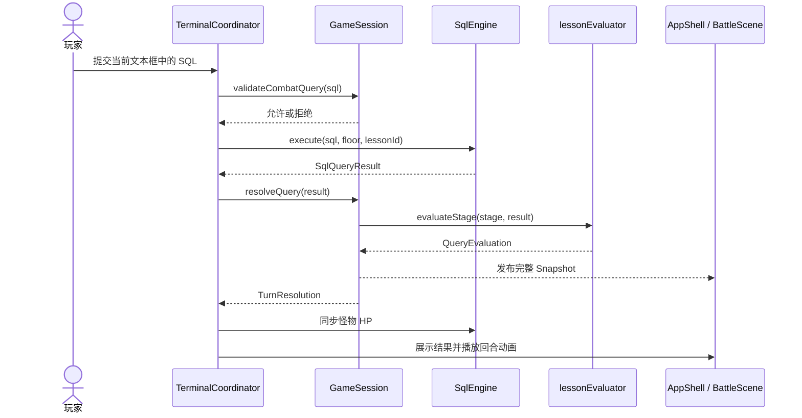
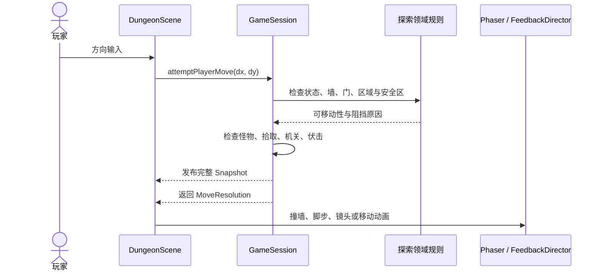
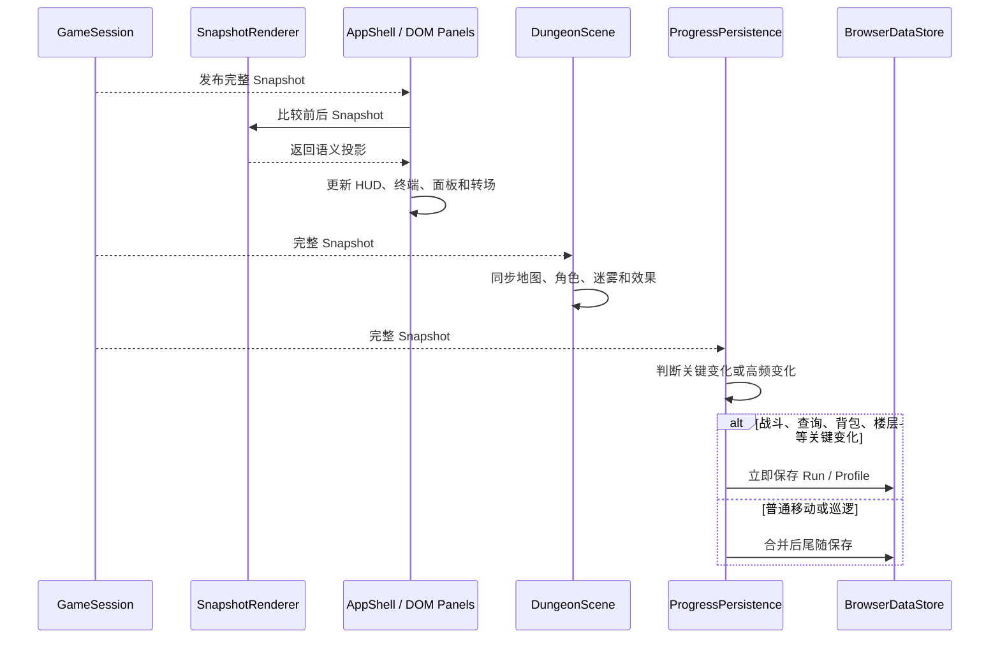

# 游戏代码流程

> 文档性质：下列时序图是依据当前源码职责绘制的说明性模拟，不是抓取的运行 Trace。
> 箭头表示主要调用或数据流，不表示跨进程网络请求。

## 总体原则

浏览器游戏由 `GameSession` 统一提交可变规则状态。输入层传递意图，领域层计算规则，
基础设施执行 SQLite 或存储操作，DOM 与 Phaser 消费结构化结果和完整快照。

## 1. SQL 判定与战斗

对应步骤：

1. `TerminalCoordinator` 读取输入并阻止空输入或重复提交。
2. `GameSession` 先执行身份披露等游戏语义保护。
3. `SqlEngine` 在浏览器 SQLite 中执行只读查询；第六层受控 DML 使用一次性副本沙箱。
4. 查询结果被整理为列、行、目标 ID、执行计划、热量和 SQL 特征。
5. `lessonEvaluator` 同时检查题目期望、作者阶段语义和当前概念锁。
6. `GameSession` 把判定结果转换为命中、反击、阶段推进、经验与奖励，并一次性发布状态。
7. 表现层根据 `TurnResolution` 和 Snapshot 展示结果，不重新判题。

源码入口：

- [一次 SQL 提交的协调](../game/src/features/terminal/TerminalCoordinator.ts)
- [SQLite 执行与查询证据](../game/src/infrastructure/sql/SqlEngine.ts)
- [课程判定聚合](../game/src/domain/learning/lessonEvaluator.ts)
- [战斗状态结算](../game/src/features/game-session/GameSession.ts)

关键边界：系统不是比较一段固定 SQL 文本。SQLite 先产生真实结果，随后领域规则检查结果语义
和必须使用的概念；执行层不决定课程是否通过，界面层也不决定战斗伤害。

## 2. 移动与遭遇

对应步骤：

1. `DungeonScene` 只把方向转换为移动意图，并在一次移动完成前锁住重复输入。
2. `GameSession` 按固定顺序检查当前模式、知识门、墙体、区域首领和篝火占位。
3. 目标格有活跃怪物时进入遭遇，不先移动玩家坐标。
4. 通过阻挡检查后才提交位置，再处理迷雾揭示、拾取、机关和步数伏击。
5. `MoveResolution` 明确说明是否移动、为何阻挡、是否遭遇以及是否触发机关。
6. Phaser 只根据结果播放碰撞、脚步、镜头和角色补间，不重新计算移动规则。

源码入口：

- [Phaser 移动入口](../game/src/presentation/phaser/DungeonScene.ts)
- [权威移动结算](../game/src/features/game-session/GameSession.ts)
- [探索领域规则](../game/src/domain/exploration/)

关键边界：地图不是静态背景。移动结果可以连接知识门、课程怪物、道具、机关、迷雾和伏击，
但空间表现与规则判定分别由 Phaser 和 `GameSession` 所有。

## 3. 快照、渲染与持久化

对应步骤：

1. `GameSession` 完成一组规则修改后，通过一次发布提供完整 Snapshot。
2. `SnapshotRenderer` 比较前后快照，生成换层、进战、拾取和音乐等语义投影。
3. `AppShell` 和各 DOM Panel 只渲染投影与快照。
4. Phaser 场景独立订阅同一状态源，同步世界对象和空间效果。
5. 持久化模块也订阅同一状态源，同时导出当前 Run 和 Profile。
6. 关键变化立即写入；普通移动与巡逻被合并，减少浏览器存储压力。

源码入口：

- [DOM 快照订阅与渲染](../game/src/features/app-shell/AppShell.ts)
- [快照语义投影](../game/src/features/snapshot/SnapshotRenderer.ts)
- [进度保存调度](../game/src/infrastructure/storage/progressPersistence.ts)
- [浏览器数据存储](../game/src/infrastructure/storage/browserDataStore.ts)

关键边界：DOM、Phaser 与存储看到的是同一状态时刻。它们可以采用不同的展示或写入节奏，
但不能各自维护一套游戏真相。
