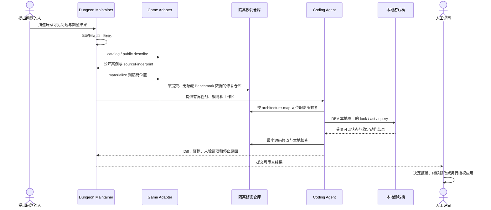

# Dungeon Maintainer 协同流程

> 文档性质：本文描述基于当前仓库边界的说明性协同模型。图中的任务编号、响应和处理状态均为模拟，
> 不代表已经启动维护器、浏览器、Benchmark runner 或 Coding Agent。

## 协同目标

维护器的作用不是替代开发者直接控制正式仓库，而是把一个问题转换为受约束、可检查、可恢复的
本地工作过程：先确认项目身份和任务范围，再提供最小证据与有限交互，修改发生在隔离边界内，
最终是否应用或发布仍由人决定。

## 完整时序



## 阶段说明

### 1. 识别仓库

维护器首先读取固定的 [`.maintainer/project.json`](../.maintainer/project.json)。当前 marker 只声明
仓库身份 `sql-dungeon`；它不包含凭据、玩家数据或执行权限。

### 2. 获取有界任务

在 Benchmark 工作流中，[Adapter](../scripts/benchmark-adapter.mjs) 是生产案例的唯一源码接口：

- `catalog` 返回公开案例目录、版本和 `sourceFingerprint`。
- public `describe` 只返回公开问题，不返回隐藏复现和 Oracle。
- `materialize` 创建单提交的隔离修复仓库，并移除 Benchmark、Adapter 和源 Task 文件。

`sourceFingerprint` 用于确认案例描述对应当前源码状态，不是源码或隐藏数据投影。

### 3. 按架构定位

Coding Agent 先读取仓库规则和 [机器架构地图](../.maintainer/architecture-map.json)，再按
`primary -> adjacent -> shared -> fallback` 逐层扩大检查范围。地图只提供稳定职责路由，
真实源码、调用流和测试仍决定修改位置。

例如，“SQL 结果正确但战斗未结算”会优先检查 `game-session` 与战斗领域服务；只有证据不足时，
才扩展到终端协调、学习判定和 SQLite 适配。

### 4. 受限本地交互

开发态游戏桥只在三个条件同时满足时存在：Vite DEV 构建、localhost 页面和
`?playtest=agent`。它使用内存数据与临时 checkpoint，不接触玩家正式 IndexedDB Run/Profile。

桥的职责边界：

| 能力 | 可做 | 不可做 |
| --- | --- | --- |
| `look` | 返回当前目标、前置说明和稳定 action ID | 返回完整地图、存档、背包或隐藏身份 |
| `act` | 执行最新匹配 revision 中的稳定动作 | 接受任意坐标、选择器或脚本 |
| `query` | 把 SQL 写入当前可见文本框并点击真实提交控件 | 接收管理员答案或读取关闭终端内容 |
| `judge` | 由固定 runner 读取有界验证摘要 | 放入模型上下文或普通动作结果 |

生产构建不得暴露可访问的 `window.__DUNGEON_PLAYTEST__`。

### 5. 隔离修改与验证

Coding Agent 只在已批准范围内修改隔离修复仓库。每项结论必须区分证据类型，例如静态检查、
单元测试、构建、浏览器验证或未验证假设。失败不会自动授权扩大范围或削弱检查。

### 6. Diff 与人工授权

维护器返回 Diff、检查结果、剩余风险和未验证项。以下动作彼此独立：

```text
只读检查 != 修改隔离仓库 != 应用到正式仓库 != Commit/Push/发布
```

完成本地修复不自动获得 apply、commit、push、merge、release 或 deployment 权限。

## 权限门

| 阶段 | 默认权限 | 继续条件 |
| --- | --- | --- |
| 定位与读取 | 只读、有界证据 | 任务与仓库身份匹配 |
| 隔离修改 | 仅批准路径和目标 | 明确变更契约 |
| 本地验证 | 允许无外部写入的检查 | 验证路径在任务范围内 |
| 应用正式仓库 | 默认不允许 | 人工明确授权 apply |
| Commit、Push、发布 | 默认不允许 | 对具体 Git/发布动作另行授权 |

## 停止条件

- 当前 revision 与动作 ID 不匹配，拒绝执行旧动作。
- 连续操作没有带来可观察进展，返回停滞而不是无限循环。
- 新证据要求修改未批准模块、接口、安全边界或数据格式。
- 需要隐藏答案、完整地图、玩家数据、凭据或其他受保护内容才能继续。
- 合并冲突无法在不覆盖用户工作的前提下解决。

## 事实来源

- [根架构中的 Maintainer Boundary](../ARCHITECTURE.md)
- [游戏架构中的 Benchmark 与运行安全边界](../game/ARCHITECTURE.md)
- [游戏维护器桥源码](../game/src/devtools/dungeon-agent/)
- [稳定仓库规则](../AGENTS.md)
