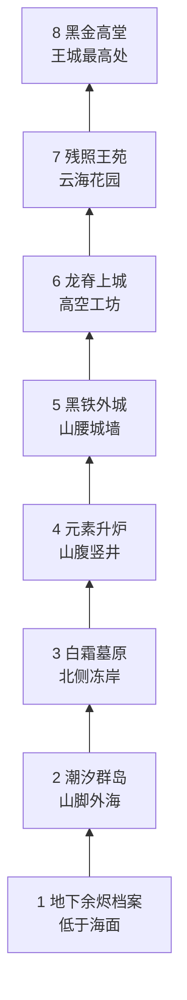

# SQL 魔王城音乐与地图上升设计圣经

> 状态：`APPROVED_DIRECTION / IN_IMPLEMENTATION`
> 日期：2026-07-24
> 类型：MVP 2.0 音乐与地图目标方向；实现与验收以
> [MVP 2.0 设计与实施基线](./MVP_2_0_MASTER_PLAN.md) 为准
> 关联：[叙事圣经](./NARRATIVE_BIBLE.md) /
> [探索改造计划](./NARRATIVE_EXPLORATION_REDESIGN_PLAN.md) /
> [八层课程](../CURRICULUM.zh-CN.md)

## 1. 本次目标

把八层地图和音乐统一成一条可以被看见、被听见的旅程：

> 从海中黑山的地下余烬出发，经过海洋、冰原和山腹升炉，最终登上被落日残晖照亮的黑金高堂。

音乐不再为每层拼接互不相关的曲目，而是让同一个原创主题从 A 小调逐渐变化为 A 大调。地图的
高度、光线、空间尺度和音乐编制同时增长，最终的辉煌中仍保留空城的凄凉。

## 2. 用户与干系人

| 角色 | 需要确认的结果 |
|---|---|
| 玩家 | 能否感到自己一直在登向同一座王城，而不是切换八张皮肤 |
| 游戏策划 | 地图、课程、剧情证据和情绪节奏是否互相支持 |
| 关卡设计 | 每层的主路线、捷径、远景和过渡设施是否有明确职责 |
| 音频 | 同一主题如何随楼层、战斗与篝火变化而不造成疲劳 |
| 美术 | 海洋、冰原、升炉、外城、王苑与高堂的光线及材质边界 |
| 工程 | 设计是否能在现有 Phaser、30 FPS 和程序化 Web Audio 预算内实现 |

## 3. 已确认决策

| ID | 决策 | 状态 |
|---|---|---|
| `MA-001` | 世界是一座建在海中黑山上的垂直王城 | `CONFIRMED` |
| `MA-002` | 主体验从地下出发，最终抵达王城高堂 | `CONFIRMED` |
| `MA-003` | 前段以温暖小调和小编制为主，后段逐渐扩展成大调大编制 | `CONFIRMED` |
| `MA-004` | 水域采用真正的海洋与群岛，不退化成狭小装饰湖 | `CONFIRMED` |
| `MA-005` | 第三层采用冰原与墓城融合，不只做白色换皮 | `CONFIRMED` |
| `MA-006` | 战斗通过速度、切分和低音推进制造紧张，不用尖锐波形和噪声墙 | `CONFIRMED` |
| `MA-007` | 第八层辉煌但不凯旋，保留落日、空王座和借用小调和弦的凄凉 | `CONFIRMED` |
| `MA-008` | 音乐底层跨小节延续，不在每个乐句后完全熄火 | `CANDIDATE_V3` |
| `MA-009` | 高堂以程序化大提琴持续叙述、圆号长句回应主题 | `CANDIDATE_V3` |

这些决策已经纳入 MVP 2.0 实施授权；正式 Run、存档与课程的兼容边界由 MVP 2.0 基线约束。

## 4. MVP 范围

- 八层空间高度、主地貌、光线与音乐调性演进；
- 每层一个主地图动作、一个远景和一个回程结构；
- 一套贯穿八层的原创主题；
- 篝火、探索、战斗与 Boss 的变奏规则；
- 三段方向试听：第一层探索、第一层战斗、第八层高堂；
- 试听的生成脚本、参数、哈希和淘汰记录。

## 5. 本次不做

- 不制作八层正式 Tilemap、Sprite、碰撞、怪物或环境动画；
- 不替换当前运行时音乐；
- 不引入录音、采样库、SoundFont、第三方 MIDI 或商业游戏旋律；
- 不把“大编制”理解成加载大型交响乐音源；
- 不改变已经确认的八层 SQL 课程顺序；
- 不提交、推送、创建或合并 PR。

## 6. 世界空间：海中黑山王城

王城不是八个平行副本，而是一座环绕黑山向上修建的城市。



路线允许绕山、入海和进入山腹，不要求玩家一直沿直楼梯上升；但每层结尾都必须在地标、远景
或过渡动画中明确显示高度发生了变化。

## 7. 八层地图与音乐联合定义

### 7.1 总览

| 层 | 区域 | SQL | 地图动作 | 光线 | 音乐 |
|---:|---|---|---|---|---|
| 1 | 地下余烬档案 | 单表查询 | 步行、水闸、升降机 | 炉火包围的黑暗 | A Dorian / A 小调，68 BPM |
| 2 | 潮汐群岛 | 聚合 | 上船、靠岸、开启船闸 | 月色与海面银光 | D Dorian，72 BPM，6/8 |
| 3 | 白霜墓原 | JOIN | 追踪足迹、开墓门、穿冰窟 | 灰白天光与幽蓝冰层 | E 小调，66 BPM |
| 4 | 元素升炉 | 子查询 / CTE | 切换炉区、启动垂直升炉 | 冰蓝转为熔炉橙 | B 小调向 D 大调过渡，84 BPM |
| 5 | 黑铁外城 | 窗口函数 | 城墙分区、吊桥、瞭望台 | 第一次完整看见夕阳 | G 大调夹带 E 小调，92 BPM |
| 6 | 龙脊上城 | 写操作 / 事务 | 熔岩桥、矿车、保存点 | 红金夕阳达到峰值 | D 大调，104 BPM |
| 7 | 残照王苑 | 索引 / 计划 | 路径对照、晶体捷径、根系门 | 紫红晚霞与云海 | E 大调向 A 大调靠近，78 BPM |
| 8 | 黑金高堂 | 综合八股 | 七翼回环、长阶、王座 | 最后一束残晖穿过高窗 | A 大调＋借用小调和弦，72 BPM |

### 7.2 第一层：地下余烬档案

- 保留已经确认的城门登记厅、排水渠、史莱姆池、余烬仓库、地下档案、三篝火和两条捷径；
- 地图位于海平面以下，墙缝偶尔传来潮声，为第二层海洋做听觉预告；
- 空间紧凑，火光小而稳定；这是唯一真正像“家”的区域；
- 抄写员与第一处篝火共同建立安全感；
- Boss 后不使用抽象传送门，档案升降机上行到山脚潮汐码头。

### 7.3 第二层：潮汐群岛

水域使用真正的海洋体验，但不追求巨大面积：

- 一片核心海域、三座主岛、一处沉船区和一个 Boss 海湾；
- 海面负责空间感，岛屿负责学习密度；
- 上船后玩家替换为低帧像素船，不加入真实浮力和水流物理；
- 航线初看绕远，开启中央船闸后形成返回起始码头的短航路；
- 多条潮流、岛屿记录和居民信号在中央灯塔汇聚，对应聚合与分组；
- 远景始终能看到黑山王城，保证玩家知道最终方向。

### 7.4 第三层：白霜墓原

冰原与墓城合并：

- 宽阔冻原负责风景、足迹和远距离地标；
- 冰下墓室负责 JOIN、遗物关系和紧凑遭遇；
- 冰层下可见旧建筑与未被当前记录承认的人；
- 主捷径是从墓室内部打开的冰封王门，回到避风营地；
- 风雪不能持续遮挡视野；只使用低密度、离散、可暂停的像素线；
- 尽头的葬火井连接第四层山腹升炉。

### 7.5 第四层：元素升炉

- 火、冰、雷区域围绕一座贯穿黑山的垂直机械竖井；
- 子查询区域嵌套在主区域内，但导航仍保持宽路和明确回环；
- 每完成一条依赖链，升炉上升一段；
- 最后一次启动时，玩家第一次穿过云层和城墙地基；
- 音乐由 B 小调逐步增加 D 大调和弦，承担整个游戏的“转轴”。

### 7.6 第五层：黑铁外城

- 玩家首次真正站在王城外墙上，看见完整夕阳与来时的海；
- 分区城墙对应 `PARTITION BY`，塔楼与瞭望台对应顺序和前后行；
- 回程捷径是连接不同城墙层级的吊桥；
- 地图空间比前四层更开阔，但课程锚点仍保持 20–55 格距离；
- 光线从地下局部亮源切换为统一的斜向夕阳。

### 7.7 第六层：龙脊上城

- 王室工坊和龙巢建立在山脊与高空栈道上；
- 事务沙箱表现为可恢复的工坊副本，不改永久世界；
- 熔岩、龙晶和红金夕阳共同形成全程最强烈的视觉阶段；
- 大编制第一次完整出现，但仍控制在低音和中音区；
- 捷径通过矿车或工坊升降台返回保存点。

### 7.8 第七层：残照王苑

- 保留索引森林的树根、晶体、访问路径和叶节点结构；
- 将其重构为王宫上层的悬空花园，而不是突然出现的普通森林；
- 花园外侧是云海，内侧是高堂外墙；
- 正确索引点亮较短访问路径，但原路线仍然可达；
- 夕阳开始消失，颜色由红金转为紫、玫瑰灰和冷青；
- 音乐减少战斗性，为终局留下呼吸。

### 7.9 第八层：黑金高堂

- 七个知识翼汇入中央长阶，王座位于最高处；
- 高窗只能看见落日最后的残晖，厅内大部分区域已经转暗；
- 空间宏大但人口稀少，辉煌来自尺度与和声，不来自密集装饰；
- 每完成一翼，打开一扇返回中央轴的金门；
- 最后的档案官不在热闹军阵中等待，而在几乎空无一物的王座前；
- 推荐结局完成后，A 小调主题变为 A 大调，但保留一次 C 自然音，提醒玩家过去没有被抹除。

## 8. 光线叙事

```text
余烬暖黑
→ 海面银蓝
→ 冰原灰白
→ 山腹冰蓝 / 熔炉橙
→ 初见夕阳金
→ 红金燃烧
→ 紫红残照
→ 黑金高堂中的最后一道光
```

第八层不是全场最亮的一层。第六层最明亮、最辉煌；第八层拥有最大的空间和最少的光，形成
“王城仍然庄严，但它已经没有可以庆祝的人”的感觉。

## 9. 贯穿主题

### 9.1 原始主题

第一层使用：

```text
A - C - E - B
```

终局使用：

```text
A - C# - E - B
```

只改变第三音，使熟悉的小调主题在终局获得大调解释。后半句统一使用：

```text
D - C/C# - B - A
```

这段音型为项目原创，不转录任何古典或商业游戏作品。

### 9.2 编制成长

| 阶段 | 同时声部上限 | 听觉规模 |
|---|---:|---|
| 1–2 层 | 3 | 独奏旋律、单低音、稀疏和弦 |
| 3–4 层 | 4 | 加入内声部与环境音型 |
| 5–6 层 | 5 | 八度低音、完整和弦、副旋律 |
| 7–8 层 | 6 | 宽和弦、对位回应、低频节奏层 |

大编制感来自八度、和声密度、音域和副旋律，不依赖大型采样库。

## 10. 四种音乐状态

### 10.1 篝火与抄写员

- 始终保留 A 小调 / Dorian 的“家”版本；
- 速度 62–68 BPM；
- 正弦主旋律、三角低音、极轻和弦；
- 楼层越高，只更换背景和声，不改变她的核心音色；
- 最终层可以在最后一句短暂出现 A 大调，表示她也接受了新的版本。

### 10.2 地图探索

- 每层使用同主题的调性与节奏变体；
- 和声底层与低声部跨小节延续，乐句留白时也不完全熄灭；
- 连续步行不依赖鼓点催促；
- 区域切换优先在小节边界交叉淡化；
- 水、风、冰、熔炉等环境感由稀疏音型表达，不使用持续噪声掩盖脚步和 SQL SFX。

### 10.3 普通战斗

紧张来自节奏，不来自尖锐：

- 112–126 BPM；
- 主旋律保持在 `A3–A4`，不超过 `C5`；
- 使用正弦、三角与低通过的暖方波；
- 不使用 25% Pulse 主旋律、锯齿墙、连续白噪声帽音；
- 低频鼓点使用短正弦或三角音，不使用采样；
- 同时持续声部不超过 4 个。

战斗分成三个密度阶段：

1. **遭遇引子**：约 1 秒，快速提示进入战斗；
2. **思考循环**：打开 SQL 输入后降低约 3 dB，移除最密集声部；
3. **执行回应**：提交查询时恢复两小节完整节奏，然后回到思考循环。

### 10.4 Boss

- 使用本层主题的扩展句，不另写无关旋律；
- 高堂与最终 Boss 可以用大提琴承担连续低声部、圆号承担每四小节一次的长句回应；
- 大提琴和圆号均由有限谐波振荡器模拟，不引入外部管弦乐采样；
- 速度可以比普通战斗高 6–10 BPM，但不能通过高频持续刺激；
- 阶段变化优先增加低音、和弦或节奏重音；
- 玩家停留 SQL 编辑器超过 20 秒后自动降低密度；
- 最终 Boss 将 A 小调和 A 大调交替，直到结局选择确定最后和声。

## 11. 抗疲劳音频边界

| 项目 | 约束 |
|---|---|
| 主旋律音域 | 主要位于 `A3–A4`，最高不超过 `C5` |
| 音色 | 正弦、三角、有限谐波暖方波 |
| 高频 | 音乐总线低通约 `3.2–4.0 kHz`；SFX 单独保留清晰度 |
| 音头 | 旋律 Attack 不低于 `8 ms`，避免数字点击 |
| 噪声 | 探索和战斗均不使用持续白噪声帽音 |
| 响度 | 探索约 `-22～-20 LUFS`；战斗约 `-20～-18 LUFS`，不靠突然变响制造紧张 |
| 峰值 | 试听和正式音乐均不高于 `-6 dBFS` |
| 循环 | 探索至少 28 秒，战斗至少 30 秒；避免 8 秒短句不断重复 |
| 输入状态 | SQL 编辑器打开时音乐降低约 3 dB 并减少一个节奏声部 |
| 可访问性 | 静音、Reduced Motion、页面隐藏和后台暂停继续沿用当前边界 |

## 12. 地图共同规则

每层虽然更换地貌，仍共享以下骨架：

- 一条清楚主线；
- 两到三个有名字的主要地区；
- 三个安全点或等价检查点；
- 至少一条“看得见但要绕后开启”的捷径；
- 一条中后段返回安全点的交通捷径；
- 一个持续可见的主地标；
- 一个指向下一层高度变化的过渡设施；
- 主线宏观拓扑固定，Seed 只改变普通怪、非关键资源、装饰和已审核小房间。

海洋和冰原不能用面积制造时长。连续无事件移动仍以 10–15 秒为目标上限。

## 13. 楼层过渡

| 过渡 | 设施 | 音乐变化 |
|---|---|---|
| 1 → 2 | 档案升降机抵达潮汐码头 | 炉火低音保留，加入海面 6/8 音型 |
| 2 → 3 | 船靠冻岸，冰封墓门开启 | 流动琶音逐渐变成稀疏长音 |
| 3 → 4 | 葬火井下降后接入升炉 | 冰冷小调被低频机械节奏接管 |
| 4 → 5 | 升炉冲出城墙地基 | 首次明确出现大调和弦与夕阳远景 |
| 5 → 6 | 吊桥通往龙脊工坊 | 增加八度低音和副旋律 |
| 6 → 7 | 王室升降台抵达悬空花园 | 减少鼓点，留下宽和弦与高空留白 |
| 7 → 8 | 金色长阶打开高堂大门 | A 大调主题首次完整出现 |

自动进入下一层的产品规则可以保留，但视觉上应由升降机、船、井、吊桥和长阶完成，不再让所有
楼层都依赖同一种抽象传送门。

## 14. 素材制作顺序

当前候选试听：

- [第一层探索《地下余烬》V3](./assets/music-ascent-v1/floor1-underground-hearth-exploration-preview-v3.wav)
- [第一层战斗《余烬疾行》V3](./assets/music-ascent-v1/floor1-underground-hearth-battle-preview-v3.wav)
- [第八层探索《残照高堂》V2](./assets/music-ascent-v1/floor8-sunset-high-hall-preview-v2.wav)
- [试听参数与 SHA-256](./assets/music-ascent-v1/audio-preview-manifest.json)

制作顺序：

1. 试听第一层探索、第一层战斗和第八层高堂三段候选；
2. 主观试听确认小调起点、战斗疲劳和终局规模；
3. 制作八层一页式色彩与高度缩略图；
4. 第一层只做灰盒 Blockout，不直接照概念图生产；
5. 第一层地图、篝火、战斗和区域音乐形成垂直切片；
6. 第一层通过盲测后才制作海洋船只原型；
7. 海洋通过后再验证冰原视野和风雪预算；
8. 后续楼层逐层制作，不批量生成八层正式素材。

## 15. 验收标准

- 将八层入口缩略图排成一列时，不看 HUD 也能感到高度和光线在变化；
- 玩家能用“地下—海洋—冰原—山腹—外城—上城—王苑—高堂”复述路线；
- 第一层主题和第八层主题能听出属于同一旋律；
- 战斗试听急促但没有尖锐 Pulse、连续噪声或高频疲劳；
- 第八层听起来比第一层规模更大，但仍然孤独，不像庆典；
- 三段试听均为原创程序化音频，不进入运行时 Bundle；
- 没有修改正式 Run、课程、存档或现有音频选择逻辑。

## 16. 风险与取舍

| 风险 | 取舍 |
|---|---|
| 海洋面积扩大导致空走 | 核心海域＋三主岛；航线短，船闸负责捷径 |
| 冰原开阔但缺少内容 | 地表远景＋冰下紧凑墓室，避免纯白大平原 |
| 八层连续地理限制主题自由 | 保留绕山、入海、入腹和升高四种移动方式 |
| 小调前段持续压抑 | 使用 Dorian、暖三角音色和抄写员主题提供家感 |
| 后段大调变成普通胜利曲 | 借用小调 iv、降低光线、保留空王座与长音留白 |
| 大编制增加性能与包体 | 只增加程序化声部，最多 6 个，不引入采样 |
| 战斗速度让输入焦虑 | SQL 编辑器打开时自动降密度和音量 |
| 旧尖锐试听被误用 | 明确标记 `REJECTED_REFERENCE`，新试听独立存放 |
