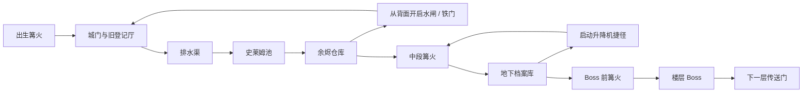

# SQL 魔王城叙事与区域探索改造计划书

> 文档版本：`v0.2`
>
> 状态：**`SUPERSEDED_FOR_DELIVERY`；原型研究仍有效，实施权限与最终范围以
> [MVP 2.0 设计与实施基线](./MVP_2_0_MASTER_PLAN.md) 为准**
>
> 需求级别：`L2 — durable specification`
>
> 当前基线：`v1.1.0`
>
> 第一交付目标：通过现有管理员模式试玩第一层手工区域地图原型，不覆盖正式 Run

文档控制：

| 字段 | 内容 |
|---|---|
| 文档类型 | 项目级设计与交付计划（`GDD-lite + Prototype Charter`） |
| 设计负责人 / 决策人 | 项目作者 |
| 实现与验证责任 | 项目作者与 AI coding 协作 Agent；结论必须附代码、测试或试玩证据 |
| 本轮授权范围 | 本文保留为历史原型与研究依据；MVP 2.0 已另行授权实现 |
| 未授权范围 | 本文不再单独授权扩大 MVP 2.0 基线之外的隐藏地区、多结局或外部服务 |
| 文档状态流 | `DRAFT → READY_FOR_REVIEW → APPROVED` |
| 交付 / Issue 状态流 | `NOT_STARTED → IN_DISCUSSION → READY_FOR_REVIEW → APPROVED_FOR_PROTOTYPE → IN_PROGRESS → IMPLEMENTED → VALIDATED / REWORK / ON_HOLD / STOP / NOT_PLANNED` |
| 最近更新 | `2026-07-24` |

版本历史：

| 版本 | 日期 | 变化 |
|---|---|---|
| `v0.1` | 2026-07-24 | 汇总叙事、地图、Seed、装备、隐藏地区和开发者模式的共同讨论 |
| `v0.2` | 2026-07-24 | 按一页设计、设计支柱、灰盒切片、试玩验证、ADR 与大型游戏团队公开方法规范化 |

关联资料：

- [产品规则与当前实现](../../PRODUCT.md)
- [文档索引](../README.md)
- [叙事圣经](./NARRATIVE_BIBLE.md)
- [八层课程蓝图](../CURRICULUM.zh-CN.md)
- [八层地图与美术蓝图](../FLOOR_THEMES.zh-CN.md)
- [篝火、复活点与安全区](./CAMPFIRE_CHECKPOINT_DESIGN.md)
- [怪物阶级与八层生物演化](./MONSTER_PROGRESSION_DESIGN.md)
- [装备背包与掉落](./INVENTORY_AND_MULTI_DROP_DESIGN.md)

## 0. 一页设计概览

| 项目 | 定义 |
|---|---|
| 项目 | `SQL 魔王城 / SELECT * FROM DUNGEON` |
| 本计划代号 | `REGION-01 / 基础地区重构` |
| 玩家承诺 | 用真实 SQL 调查一个会对查询结果作出反馈的世界，并通过探索逐渐确认自己的身份 |
| 当前问题 | 传统连续迷宫面积大、细路和寻路占比高，区域虽有换色与地标，但空间回环与地域移动方式不足 |
| 目标体验 | 小而密的区域、可记忆地标、第一次远路与第二次捷径、确定学习与可复现变化 |
| 核心玩家动作 | 观察 → 探索 → 查询 → 战斗 → 获得证据 → 开启捷径 → 篝火复盘 |
| 第一原型 | 管理员模式中的第一层手工 Blockout，不接正式 Run |
| 第一主地标 | 城门登记碑与大型水闸 |
| 第一空间惊喜 | 玩家绕过排水渠和仓库后，从背面打开出生点旁的水闸 / 铁门 |
| 第一决策门 | 玩家能否在不依赖小地图提示的情况下理解区域和捷径 |
| 扩展顺序 | 第一层 Blockout → 第一层垂直切片 → 第二层开船 → 身份显形 → 隐藏地区 |

核心循环：

```text
进入区域
→ 观察地标、怪物与机关
→ 触发一项明确 SQL 目标
→ 查询并获得世界反馈
→ 战胜怪物或改变机关状态
→ 获得课程奖励 / 身份证据
→ 开启捷径或新安全点
→ 在篝火复盘
→ 进入下一区域
```

SQL 学习循环：

```text
阅读当前任务与完整 Schema
→ 预测需要返回的字段和记录
→ 写出完整 SQL
→ 在本地 SQLite 执行
→ 阅读结果、错误和怪物 / 机关反馈
→ 修正查询
→ 用一个变式问题确认能够迁移，而不是只记住答案
→ 篝火复盘本层错误与已掌握知识
```

地图循环负责产生问题和记忆点，学习循环负责形成知识。任何地图、剧情或掉落都不能替代
“预测 → 执行 → 解释 → 修正 → 迁移”这条学习证据链。

本计划的三条硬性支柱：

1. **查询改变理解**：SQL 结果必须改变玩家对当前怪物、地区或自己的认识；
2. **空间可以掌握**：捷径让玩家证明自己已经理解地图，而不是只减少数值化距离；
3. **玩家时间受尊重**：主线不通过扩大地图、重复赶路或低概率关键掉落延长流程。

## 1. 本次目标

把当前以 `64×48` 连续 Seed 迷宫为中心的探索，逐步改造成小而密、具有空间记忆、地域差异和
叙事用途的区域探索游戏。

核心结果：

1. SQL 学习继续是主线，赶路时间显著下降；
2. 主线地图由人工设计宏观结构，不再依赖传统细路迷宫制造探索；
3. 玩家第一次绕行后可以打开门、水闸、升降机、吊桥等捷径；
4. 每层通过地标、道路宽度、移动方式和空间状态形成独立身份；
5. Seed 继续保证遭遇与非关键变化可复现，但不决定主线地图质量；
6. 玩家掌握 SQL 的过程同时是逐渐查询并理解自己身份的过程；
7. 隐藏地区、服装收藏和更高随机度在基础地区成立后再开发。

一句话体验目标：

> 第一次绕路，第二次理解空间，第三次利用捷径掌控空间。

## 2. 用户与干系人

| 用户 / 干系人 | 需要获得的价值 |
|---|---|
| SQL 初学者 | 任务、字段、路径和当前目标明确，地图不挤占学习时间 |
| 面试复习者 | 八层知识顺序清楚，复合题与前置知识可追踪 |
| 探索型玩家 | 地标、环路、捷径、区域差异和可选发现形成探索回报 |
| 博客试玩者 | 在短时间内看到地图变化、战斗和一个清楚悬念 |
| 内容设计者 | 能先画拓扑和叙事锚点，再填 Tile、怪物与奖励 |
| 开发与测试 | 可在不污染正式 Run 的管理员模式中检查地图状态 |
| 现有玩家 | 永久 SQL 掌握和 Profile 不应因地图原型被清除 |

## 3. 当前实现基线

以下是 `CURRENT`，不是未来提案：

### 3.1 地图

- 每层当前是一张 `64×48` 连续 Seed 迷宫；
- 地图使用 `16×16` 技术分区，并在同一迷宫上覆盖三个生态区域；
- 每层有三个篝火、两个区域门、一条保证可得钥匙的双向捷径；
- 主路径信标、死路补给和安全步数用于减少纯随机迷宫造成的疲劳；
- 当前运行时仍会生成传统走廊、房间和较长步行路线。

### 3.2 Seed

- Campaign 使用同一个基础 Seed 派生八层 Seed；
- 同一个 Seed、楼层和生成器版本得到稳定地图、篝火、遭遇与掉落；
- Seed 当前会改变完整迷宫形态；
- 刷新页面不能用于重抽奖励或遭遇。

### 3.3 管理员模式

游戏已经拥有 `⌘ 管理员` 全局视图：

- 预览第 `1–8` 层；
- 显示整张地图、怪物、Boss 与区域门；
- 跳转到三个生态区域；
- 管理员预览不写入正式 Run；
- 刷新页面后恢复最后一次正式存档。

当前管理员模式还不能：

- 切换捷径的未开启 / 已开启状态；
- 单独跳转到篝火、课程、捷径、船闸和剧情锚点；
- 显示主路线拓扑、首次绕行距离和捷径节省距离；
- 预览手工区域地图与当前正式迷宫之间的对照。

### 3.4 课程漂移

当前可执行课程：

- 第一层：`SELECT / FROM → WHERE / AND → IS NULL → COUNT / GROUP BY → HAVING`；
- 第二层：`ORDER BY / LIMIT → DISTINCT → INNER JOIN → LEFT JOIN → JOIN 综合`。

共同讨论确认的长期目标：

- 第一层：单表查询；
- 第二层：聚合；
- 第三层：连接；
- 第四层：子查询与 CTE；
- 第五层：窗口函数；
- 第六层：写操作与事务；
- 第七层：索引与执行计划；
- 第八层：综合事故诊断。

课程迁移是单独的重大功能变更，不能在地图原型中暗中完成。

### 3.5 术语表

| 术语 | 本计划中的唯一含义 |
|---|---|
| `区域门 / region portal` | `CURRENT`：现有连续迷宫中连接三个生态区的两处传送交互，不等同捷径 |
| `探索捷径` | 从另一侧或机关开启后缩短已走路线的永久空间连接，如铁门、水闸、升降机、吊桥 |
| `SQL 封印门` | 用可选高难复合查询开启的支路门；成功不授予课程掌握、XP 或随机奖励 |
| `Boss 门` | 由必修课程与楼层条件控制的主线门，不允许被探索捷径绕过 |
| `楼层传送门` | 击败楼层 Boss 后进入下一层的阶段转换 |
| `Blockout / 灰盒` | 用占位 Tile 与真实碰撞验证拓扑、视线、距离和操作，不代表最终美术 |
| `垂直切片` | 同时验证核心玩法、教学、叙事、视听、状态与发布路径的代表性正式体验 |

## 4. 已确认的设计决策

以下结论已在共同讨论中确认，但尚未实现：

1. 玩家由被删除、覆盖和回滚的历史记录共同形成；
2. 魔王是拒绝错误提交并长期与王座融合的最后档案官；
3. 推荐真结局是备份、审计、验证、切换和保留回滚方案的 `MIGRATE`；
4. SQL 学习代表玩家逐渐掌握查询自己、理解自己的能力；
5. 人物每两层产生一次主要“身份显形”，每层增加一个较小视觉细节；
6. 武器、防具与服装分离：装备承担属性，服装承担永久外观收藏；
7. 基础地区优先，隐藏洞穴、海域、冰原和镜像地区后置；
8. 保留余烬、湖沼、墓城、元素、黑铁、龙巢、水晶和王座八层视觉主题；
9. 主线地图改为紧凑的手工区域，不继续扩大传统迷宫；
10. 道路允许宽街、广场、湖面、森林空地和不规则轮廓；
11. 第二层以湖海群岛和开船作为目标探索方向；
12. Seed 保留，但调整为“固定宏观骨架，随机非关键细节”。

## 5. 产品支柱

### 5.1 地图是一个地方，不是一张算法结果

玩家隐藏 HUD 后，仍应能通过码头、水闸、巨树、钟楼、熔炉、城门和王座判断自己所在区域。

### 5.2 捷径是空间理解的奖励

捷径不只是一扇门，也可以是：

- 从背面打开的铁门；
- 排空水域的大型水闸；
- 返回篝火的升降机；
- 放下的吊桥；
- 倒下后跨越沟壑的巨树；
- 开启后的直达航道；
- 激活的水晶传送点；
- 两个历史版本重叠后形成的新道路。

### 5.3 随机不能破坏设计

课程、Boss、篝火、捷径、地标、剧情证据和主岛固定存在。Seed 只能改变允许变化的部分。

### 5.4 剧情由玩法证明

身份异常、世界事故和人物关系优先通过 SQL 结果、地图状态、装备来源和 Boss 阶段表达，
不依赖长篇过场。

### 5.5 每次只加入一种主要新体验

第一层先验证区域地图和捷径；第二层再验证开船；隐藏副本与服装收藏不能与第一层地图重构
同时进入实现。

### 5.6 反支柱

出现以下倾向时应立即缩减或返工：

- 用细窄走廊、重复墙体和大面积空地制造“内容很多”的错觉；
- 让主线地标、课程入口、Boss、篝火或关键奖励由随机概率决定；
- 用 HUD 箭头掩盖视线、轮廓、地标或路径关系不清；
- 用长篇文本解释本可由 SQL 结果、环境状态或角色动作证明的剧情；
- 用高掉率、稀有度和数值膨胀替代学习反馈；
- 为展示技术而加入物理、Shader、联网 Agent 或无法验证的复杂系统；
- 让一次错误查询产生与错误原因无关的惩罚，导致玩家只猜答案。

### 5.7 设计价值

1. **尊重玩家时间**：每段移动都应通向决策、反馈、发现或学习；
2. **结果诚实**：SQL 结果、判题原因和世界反馈必须一致；
3. **确定核心**：必修知识与主线证据始终可达、可复现；
4. **局部惊喜**：Seed 和探索奖励提供变化，但不能接管关键体验；
5. **可观察迭代**：每个原型只验证少量假设，失败时知道应该改哪里。

## 6. 第一交付：管理员模式地图原型

### 6.1 MVP 目标

先交付一个只在管理员预览中可进入的第一层区域地图原型，用于验证：

- 地图是否像一个真实地下城区，而不是随机迷宫；
- 宽路、广场和不规则边界是否容易辨认；
- 两条捷径是否产生明显的空间回环；
- 首次绕行与捷径回程的时间差是否有价值；
- 三个篝火的位置是否合理；
- 玩家是否能通过地标而不是小地图完成导航。

单次自然路线试玩目标为 `10–15` 分钟，包含从出生点走到 Boss 占位、开启并再次使用两条捷径；
不包含试玩前说明、试玩后访谈和任何 `dev_*` 跳转，也不代表正式第一层的 SQL 思考时长。

### 6.2 MVP 范围

- 一张第一层手工宏观布局；
- 三个紧凑基础地区；
- 三个可见实体篝火占位与真实安全区 Mask；
- 两种捷径：
  - 水闸或背面铁门；
  - 升降机；
- 出生点、课程占位点、Boss 占位点和下一层传送门；
- 管理员模式中的“正式迷宫 / 区域原型”切换；
- 管理员锚点跳转；
- 捷径开启前后预览；
- 管理员内的“小地图 / 导航 HUD 显示”开关；
- 不写入正式 Run；
- 复用现有玩家像素、碰撞、相机和小地图；认知地图盲测隐藏小地图，正常 UI 冒烟保留小地图。

### 6.2.1 原型真实性边界

| 类型 | 第一版要求 |
|---|---|
| 必须真实 | 玩家移动与碰撞、三区拓扑、地标视线、捷径开启前后路径、三处篝火实体占位及其安全区 Mask、管理员与正式 Run 隔离 |
| 可以占位 | 怪物、课程、Boss、剧情证据、Tile、美术、音乐和掉落；只要占位物不误导拓扑结论 |
| 可以模拟 | 捷径开关、课程门已完成状态、Boss 已击败状态；仅在管理员内存快照中存在 |
| 本轮禁止接入 | 正式 Campaign、正式存档迁移、课程重排、永久奖励、第二层开船和隐藏地区 |

原型不是缩小版正式关卡。它必须真实验证最危险的空间假设，同时主动伪造与该假设无关的内容，
避免把资源消耗在尚未证明有效的美术和系统上。

### 6.3 MVP 不做什么

- 不接入正式 Campaign；
- 不迁移当前课程顺序；
- 不改正式存档格式；
- 不制作第二层船只；
- 不实现隐藏副本；
- 不实现服装收藏；
- 不实现完整剧情台词和多结局；
- 不重做八层；
- 不增加第三方地图编辑器、物理库或渲染依赖；
- 不制作实时光照、水体反射、阴影或后处理 Shader。

### 6.4 功能优先级

| 优先级 | 内容 | 退出条件 |
|---|---|---|
| `P0 / 必须` | 手工拓扑、三区、三处篝火实体及安全区 Mask、两捷径、地标、管理员隔离 | 缺少任一项则原型不进入评审 |
| `P1 / 应该` | 锚点跳转、捷径状态切换、路径长度、碰撞与安全区检查 | 可以在同一 PR 补齐，但不能拖入正式 Run |
| `P2 / 可后置` | 环境音、占位剧情、地图标注优化 | 不影响拓扑结论 |
| `OUT / 本轮禁止` | 正式课程迁移、船只、服装、隐藏地区、八层批量改造 | 移入后续独立 PR |

### 6.5 原型需要回答的问题

| 假设 | 观察方法 | 第一轮决策门 |
|---|---|---|
| `H1` 玩家能建立认知地图 | 隐藏小地图与导航 HUD、不解释路线的盲测；结束后把“城门 → 排水渠 → 史莱姆池 → 仓库 → 档案库 → Boss”及两条回环作为预设评分答案 | 至少 `4/5` 名试玩者能按相邻关系复述三区、出生点和 Boss 方向 |
| `H2` 捷径产生“原来在这里”的理解 | 捷径开启后安排一个自然返回旧区域的目标，不提示路线；记录首次看见、背面开启和再次使用 | 至少 `4/5` 名试玩者主动使用已开启捷径 |
| `H3` 捷径有实际价值 | 对同一对锚点记录开启前 / 后最短路径，并比较玩家同方向实走时间 | 捷径后的路径长度及实走中位用时均不高于开启前的 `40%` |
| `H4` 地图密度足够 | 将地区进入、首次地标、交互、战斗预告、篝火、捷径、可见新目标定义为有效事件；观察者标记事件之间是否只有持续移动 | 不出现超过 `15` 秒且无有效事件、无路线选择、无主动观察的连续空走 |
| `H5` 原型不污染正式进度 | 先显式 Flush 待写正式进度，再记录全部 `select-from-dungeon:*` 正式持久化键的基线 Hash；退出原型后再次比较，本地 `dev` 记录单独排除 | SavedRun、Profile、Onboarding 及其他正式键逐字节不变 |

第一轮目标为五名未参与制作、符合 SQL 初学者 / 面试复习者画像的试玩者。`4/5` 只作为早期
定性原型门槛，不宣称具有统计显著性。若样本不足，应记录实际样本数，不用开发者自测替代玩家
结论。

### 6.5.1 第一层正式垂直切片的学习假设

这些假设属于 PR 3，不阻塞 PR 2 的纯地图 Blockout：

| 假设 | 证据 | 早期通过门槛 |
|---|---|---|
| `L1` 玩家理解任务而非猜关键词 | 提交前让玩家口述目标表、字段与筛选条件 | 至少 `4/5` 次能够说明“为什么这样查” |
| `L2` 错误反馈能引导修正 | 观察一次错误后是否能在不看完整答案时定位语法或语义问题 | 至少 `4/5` 次在三级提示前完成有效修正 |
| `L3` 掌握可迁移而非背诵 | 战后用不同 `id`、名字或条件给出同结构变式题 | 至少 `4/5` 次能独立写出等价结构 |
| `L4` 场景强化了知识记忆 | 试玩后让玩家把 SQL 概念与怪物 / 机关 / 地区对应 | 至少 `4/5` 次能正确复述本层三个知识锚点 |

这些数据只用于判断设计是否值得继续，不形成用户画像，不上传，也不代替后续更大样本的教学
有效性评估。

### 6.6 返工 / 停止条件

- 三次或更多试玩需要口头指路才能抵达中段：先返工地标和视线，不增加 HUD 箭头；
- 玩家打开捷径却不知道它连接哪里：调整预告、轮廓和开启反馈；
- 捷径节省不足一半路程：重新连接拓扑，不用提高移动速度掩盖问题；
- Blockout 尚未通过就开始制作完整 Tile、美术和音乐：停止内容扩张；
- 原型必须修改正式存档才能运行：退回管理员隔离方案；
- 第一层未通过上述门槛：不进入第二层开船和隐藏地区。

## 7. 第一层区域设计

### 7.1 地区组成

| 地区 | 空间形式 | 教学 / 剧情用途 | 地标 |
|---|---|---|---|
| 城门与旧登记厅 | 宽阔入口、柱廊、封闭捷径门 | 身份查询返回 `0 rows` | 巨型登记碑、出生篝火 |
| 排水渠与史莱姆池 | 宽窄交替、水渠环路、不规则池岸 | 单表过滤、第一批怪物 | 水车、闸门、发光污水 |
| 余烬仓库与地下档案库 | 仓库广场、货架群、升降机 | 组合条件、层末身份残页 | 余烬熔炉、档案升降机 |

### 7.2 拓扑草图



### 7.3 空间规则

- 普通道路宽度以 `2–4` 格为主；
- 城门、仓库和登记厅允许 `5–8` 格宽的开放空间；
- 狭窄单格通道只用于短暂压迫，不作为主要行走方式；
- 连续空走目标不超过 `10–15` 秒；
- 长走廊必须有地标、敌人预告、交互或视野目标；
- 死路必须有奖励、线索、未来入口或明显景观；
- 首次抵达中段篝火的目标时间约为 `2` 分钟；
- 第一条捷径开启后，中段返回出生区目标约为 `20–30` 秒；
- Boss 前捷径不能跳过必修课程；
- 出生时应能看见一处之后才会从背面开启的结构。

以上是原型目标，不是未经实测的永久数值。试玩结果可以调整。

### 7.4 三种门

| 门 | 开启方式 | 作用 |
|---|---|---|
| 探索捷径 | 从背面打开或启动机关 | 奖励空间理解，减少重复赶路 |
| SQL 封印门 | 完成可选复合查询 | 通向宝箱、预习内容或未来隐藏地区 |
| 主线 / Boss 门 | 满足课程与楼层条件 | 保证必修知识不会被绕过 |

三种门必须拥有不同轮廓、颜色、提示与音效，不能让玩家反复试错才知道规则。

## 8. Seed 策略

### 8.1 推荐方案

保留内部 `baseSeed`，但将地图生成改为：

```text
手工楼层拓扑
→ 固定地区边界、地标、篝火、捷径和课程锚点
→ Seed 选择已审核的小型房间 / 装饰变体
→ Seed 放置普通怪、非关键恢复品和环境细节
→ 可达性、课程门和捷径验证
```

一句话：

> 主线骨架固定，局部细节随机。

### 8.2 固定与随机边界

| 必须固定 | 可以由 Seed 控制 |
|---|---|
| 地区宏观轮廓 | 草木、碎石、货箱和水面装饰 |
| 主路线和捷径关系 | 普通怪站位与小型编组 |
| 三个篝火与安全区 | 低概率恢复品 |
| 课程、Boss 和传送门 | 非关键小支路与壁龛变体 |
| 关键剧情证据 | 环境音细节与探索曲目顺序 |
| 船闸、码头和主岛 | 礁石、芦苇和非阻塞小岛装饰 |

### 8.3 为什么不删除 Seed

- 当前存档、Campaign、遭遇和掉落已经依赖稳定 Seed；
- Seed 便于复现 Bug、测试路径和分享地图；
- 同一场试玩可以精确复盘；
- 后续隐藏副本和挑战模式可以使用更高随机度；
- 删除 Seed 不会自动产生好地图，反而会扩大迁移范围。

### 8.4 为什么不让 Seed 决定主线拓扑

- 随机拓扑很难稳定制造“远路最终回到出生点背后”的体验；
- 地标视线、剧情节奏和门的预告需要人工安排；
- 船闸、升降机、广场和不规则海岸不适合用传统迷宫规则拼接；
- 完整随机会显著增加可达性、提示、窄屏和存档测试成本。

## 9. 第二层方向：湖海群岛与开船

第二层属于后续基础地区，不进入第一交付。

### 9.1 地图组成

- 岸边出生码头；
- 开阔湖面；
- 小岛村落；
- 沉船区；
- 泥沼河口；
- 古树岛；
- 湖中 Boss 区；
- 通关后开启的中央船闸航道。

### 9.2 船只 MVP 候选

- 码头相邻格按 `E` 上船 / 下船；
- 玩家显示替换为低帧船只像素图；
- WASD 在水面可行走掩码中移动；
- 不使用真实浮力、刚体或水流物理；
- 水怪通过水面波纹或可见影子预告；
- 触碰后进入统一 SQL 战斗界面；
- 战斗结束回到原船位；
- 篝火放置在稳定陆地区域；
- 船闸开启后形成明显短航线。

### 9.3 聚合剧情候选

湖区人口总数与不同姓名数量不一致。玩家通过 `COUNT`、`GROUP BY` 和 `HAVING` 发现：

- 多条居民记录指向同一具身体；
- 同一个恢复标记出现在不同名字下；
- 玩家并非唯一的身份异常，只是唯一仍能自由行动的异常。

## 10. 八层基础地区方向

| 层 | 基础地区 | 探索动作 | SQL 方向 | 身份揭示 |
|---|---|---|---|---|
| 1 | 城门、排水渠、余烬仓库 | 步行、水闸、升降机 | 单表查询 | 档案里没有玩家 |
| 2 | 湖泊、泥沼、古树群岛 | 开船、码头、船闸 | 聚合 | 多条记录可能属于玩家 |
| 3 | 荒地、墓园、地下墓室 | 地上 / 地下升降 | JOIN | 多名死者与玩家物品有关 |
| 4 | 火焰熔炉、冰库、雷晶核心 | 切换区域状态 | 子查询 / CTE | 所有异常来自同一次命令 |
| 5 | 黑铁外城、兵营、竞技场 | 城门、吊桥、排名路线 | 窗口函数 | 玩家出现在多个历史顺序中 |
| 6 | 孵化场、晶洞、龙王巢穴 | 熔岩桥、矿车、事务沙箱 | 写操作 / 事务 | 玩家来自 Undo 历史 |
| 7 | 水晶林、根系区、索引树心 | 水晶传送、路径对照 | 索引 / 执行计划 | 记录未消失，只是当前路径不可达 |
| 8 | 版本长廊、虚空王庭、数据王座 | 历史版本切换 | 综合事故诊断 | 玩家是众多旧记录的集合 |

八层只确定方向。第一层原型未通过前，不批量制作其余楼层。

## 11. 复合剧情结构

每层同时存在四条线：

| 叙事线 | 是否必看 | 作用 |
|---|---|---|
| 本层事件 | 必看 | 提供清楚、可解决的当前问题 |
| SQL 调查 | 必看 | 用本层知识证明原因 |
| 玩家身份 | 必看 | 每层给出一条确定证据 |
| 被回滚的旧世界 | 可选 | 由后续隐藏地区深化人物与代价 |

主线真相不能依赖随机怪物、随机掉落或隐藏副本。隐藏内容只补充普通人的经历、服装来源和不同
立场。

## 12. 人物显形与收集

### 12.1 身份显形

| 阶段 | 解锁点 | 视觉方向 | 叙事意义 |
|---|---|---|---|
| 无名残影 | 开始 | 白面、简单蓝衣、轮廓不完整 | 玩家认为自己只是失忆 |
| 轮廓恢复 | 第二层结束 | 发光边缘、第一枚 SQL 符文 | 玩家确认自己与多条记录有关 |
| 关系织体 | 第四层结束 | 披风连接线、短暂他人残影 | 玩家发现自己包含不同关系 |
| 写入载体 | 第六层结束 | 核心、护手、写权限标记 | 玩家理解事务与 Undo 身份 |
| 众名集合 | 第八层结束 | 多个轮廓短暂分离后重合 | 玩家接受自己不是单一记录 |

每层可以增加一个小细节，但完整形态只每两层制作一次，控制像素动画成本。

### 12.2 装备与服装

- 武器：显示在主手，承担伤害和查询特性；
- 防具：改变躯干、肩部和护甲生命；
- 服装：永久外观收藏，不提供战斗优势；
- 身份符文：覆盖在基础形态之上；
- 战斗中禁止换装；
- 后续在背包增加独立“外观”页，不增加篝火菜单负担。

目标渲染最多使用基础形态、护甲 / 服装、武器和符文四层。正式实现时可在换装时合成纹理，
避免复杂实时特效。

## 13. 隐藏地区后置计划

基础地区稳定后，再按每两层一个隐藏地区开发：

| 隐藏地区 | 发现 / 建议通关 | 复合知识 | 主要奖励 |
|---|---|---|---|
| 地下洞穴 | 第一层发现 / 第二层通关 | 单表＋聚合 | 洞穴探险服 |
| 沉没海域 | 第三层发现 / 第四层通关 | JOIN＋子查询 | 潮汐学者服 |
| 冰封遗迹 | 第五层发现 / 第六层通关 | 窗口＋事务 | 回滚骑士服 |
| 镜像王庭 | 第七层发现 / 第八层通关 | 索引＋版本判断 | 众名披风 |

规则：

- 入口每个 Seed 都保证存在；
- 高级玩家可以提前解出复合题；
- 普通玩家掌握后续知识后返回；
- 隐藏地区紧凑，目标时长 `8–12` 分钟；
- 核心世界真相和推荐结局不能要求隐藏地区全收集；
- 服装永久收藏需要独立 Profile 迁移，不能复用当前 Run 背包假装完成。

## 14. 管理员 / 开发者模式计划

`CURRENT` 只有现有 `⌘ 管理员` 预览；下文的“开发者检查器”是计划在该安全边界内增加的目标能力，
不是另一套已经存在的系统，也不默认进入面向玩家的正式 UI。

### 14.1 保留现有安全边界

- 进入管理员预览前先显式 Flush 待写的正式移动，Flush 完成后才采集隔离测试的基线 Hash；
- 管理员快照永远不写入正式 Run；
- 管理员模式不能授予永久课程掌握、XP、装备或收藏；
- 刷新页面恢复最后正式状态；
- 正式存档控制器继续拒绝管理员快照。

### 14.2 地图原型需要增加

- `正式迷宫 / 第一层区域原型` 选择；
- 生成 Seed 与布局版本显示；
- 跳转到出生点、三个篝火、两条捷径、课程锚点和 Boss；
- 切换捷径开启前 / 开启后；
- 显示主线路径和捷径路径长度；
- 显示不可达格、阻挡格和安全区；
- 一键重置原型状态；
- 后续第二层增加上船点、下船点、水面掩码和船闸状态。

开发者功能首先服务内容检查，不做作弊菜单。

### 14.3 本地试玩证据

管理员模式可以增加仅本地、显式开启的试玩记录器，用于重现路径和验证假设：

| 事件 | 最小字段 |
|---|---|
| `prototype_started` | `build_id`（Commit SHA 或 dirty-worktree fingerprint）、布局版本、楼层、Seed、时间 |
| `region_entered` | 地区、玩家位置、进入方式 |
| `landmark_seen` | 地标、首次进入视野时间 |
| `shortcut_seen` / `opened` / `used` | 捷径、状态、累计步数与经过时间 |
| `campfire_reached` | 篝火、累计步数与经过时间 |
| `sql_failed` / `succeeded` | 课程 ID、结果类别、提示等级；默认不导出完整 SQL 文本 |
| `hint_used` | 课程 ID、提示层级 |
| `dev_teleport` / `dev_state_changed` | 操作目标，确保调试行为不混入正式试玩结论 |
| `prototype_ended` | 时长、步数、完成状态 |

边界：

- 默认关闭，只在管理员原型中显式启用；
- 只保存在当前浏览器内存，用户主动点击后才导出 JSON；
- 不接 API、账号、分析 SDK 或后台；
- 正式 Run 不记录移动轨迹和按键；
- 试玩报告必须区分自然行为和 `dev_*` 调试行为；
- 同一份证据记录构建提交、布局版本和 Seed，避免“截图无法复现”。

开发者模式后续可以加入无敌、暂停遭遇和跳过战斗，但只为重现地图状态；这些状态不能写入
正式存档，也不能算作体验验收证据。

## 15. 版本与 PR 顺序

不预先承诺日期或正式 SemVer；每个阶段独立分支、PR、验证和合并记录。

| PR | 相对成本 | 最大未知项 |
|---|---|---|
| PR 1 文档 | `S` | 共同确认地图形态与状态边界 |
| PR 2 地图 Blockout | `M` | 一张连续小地图能否在现有 Phaser 渲染中形成清楚地标与回环 |
| PR 3 第一层垂直切片 | `L` | 课程迁移、旧 Run、叙事状态与正式地图替换 |
| PR 4 船只 | `M–L` | 水陆状态、输入、战斗回位和触控 |
| PR 5 外观 | `M` | 分层像素组合、Profile 迁移和性能 |
| PR 6 隐藏洞穴 | `M` | 跨层知识门、返回路径和永久奖励边界 |

成本只表示相对范围，不是工时承诺；任何阶段发现新存档、依赖或数据库结构变更时都必须重新
回到需求确认。

### PR 1：计划书与叙事事实

- 本计划书；
- 叙事圣经已确认决策同步；
- 文档索引；
- 不改代码。

### PR 2：第一层开发者地图原型

- 手工宏观布局；
- 宽路、广场和不规则边界；
- 三个可见实体篝火占位及可检查的安全区 Mask；
- 两条捷径；
- 管理员跳转与状态切换；
- 不接正式 Run。

### PR 3：第一层正式垂直切片

- 接入移动、怪物、课程、篝火、死亡回归、Boss 和传送门；
- 接入叙事圣经定义的第一层最小闭环：
  - 不超过三行的开场悬念；
  - 玩家身份查询返回异常；
  - 一项可验证的篝火异常；
  - 一名承担复盘作用的角色或记录；
  - 通过不同渠道必然获得的两条身份证据；
  - Boss 对身份异常作出反应；
  - 本地《失名录》低保真入口；
- 决定课程迁移与旧存档处理；
- 通过后替换第一层正式迷宫。

### PR 4：第二层湖海群岛原型

- 船只、水面掩码、码头和船闸；
- 第二层聚合路线；
- 不同时实现隐藏海域。

### PR 5：身份显形与外观收藏

- 每两层基础形态；
- 外观页；
- 永久收藏字段与迁移；
- 固定奖励路径。

### PR 6：第一个隐藏洞穴

- 复合 SQL 门；
- 紧凑副本；
- 副本 Boss；
- 洞穴探险服与可选记忆。

### 后续 PR

按一层或一个独立机制一份 PR 推进，不在单个版本中同时重做八层。

## 16. 预计改动范围

具体文件以实现前再次核对为准。

### 16.1 PR 2 允许范围：管理员隔离原型

优先新增隔离模块，避免把尚未验证的地图模型写进正式生成链：

- `src/content/prototypes/floor1RegionPrototype.ts`：手工 Tile、地区、地标、篝火 Mask、捷径与锚点；
- `src/domain/prototypeLayout.ts`：只读原型状态、捷径开关和锚点跳转；
- `src/domain/prototypeValidation.ts`：可达性、路径、锚点、安全区和捷径不变量；
- `src/domain/GameSession.ts`：只增加管理员内存快照的原型加载边界；
- `src/game/DungeonScene.ts`：复用现有玩家、相机与碰撞渲染原型；
- `src/ui/AppShell.ts`：正式迷宫 / 区域原型选择、状态切换、覆盖层和本地证据导出；
- `src/style.css`：管理员检查器所需的最小样式；
- `tests/`：新增原型布局、路径、管理员隔离与输入冒烟测试。

PR 2 默认不修改：

- `mazeGenerator.ts`、`biome.ts`、`campfire.ts`、`guidedMap.ts` 的正式 Run 行为；
- `localProgress.ts`、`progressPersistence.ts` 和 SavedRun / Profile 结构；
- `floorContracts.ts`、课程内容、SQL Schema、掉落、XP 和战斗规则；
- 生产依赖与构建配置。

若实现证明必须触碰正式生成链，PR 2 必须增加旧布局版本、固定 Seed 输出和完整序列化存档前后
Hash 回归证据；无法证明正式行为零变化时，退回独立原型模块。

### 16.2 PR 3 及后续候选范围

只有 PR 2 通过体验门禁后，才重新核对并批准：

- `src/domain/mazeGenerator.ts`：从完整迷宫生成演进为布局策略入口；
- `src/domain/mazeValidation.ts`：正式加入区域、捷径和锚点不变量；
- `src/domain/biome.ts`：从迷宫覆盖区演进为明确区域契约；
- `src/domain/campfire.ts`：复用手工锚点并执行恢复、复活和安全区规则；
- `src/domain/guidedMap.ts`：从长路线信标转为地标与目标引导；
- `src/domain/types.ts`：正式布局、捷径和后续移动方式类型；
- `src/content/`：第一层课程锚点、剧情证据与后续船只内容；
- `src/game/gameInput.ts`：第二层上船 / 下船输入状态；
- `src/audio/ArcadeAudio.ts`：通过地图原型后再接区域音乐切换。

### 16.3 存档与迁移

PR 2 的管理员原型不修改正式存档。

PR 3 正式接入时可能需要：

- 新的生成器版本；
- 新 SavedRun 版本或安全重开策略；
- 保留永久 Profile、课程掌握、尝试次数和胜利记录；
- 旧 Run 是否迁移到新地图必须在实现前单独批准。

PR 5 的永久服装收藏需要 Profile 字段和迁移，不能提前加入。

### 16.4 分阶段测试范围

| 阶段 | 必须验证 |
|---|---|
| PR 2 地图 Blockout | 布局与可达性、同锚点捷径前后路径、三篝火 Mask、管理员不持久化、正式状态 Hash 不变、桌面 / 窄屏 / 触控冒烟 |
| PR 3 第一层垂直切片 | 课程门不可绕过、SQL 学习循环、死亡 / 撤退 / 篝火、叙事证据、Boss 与传送、旧 Run 迁移或明确回退 |
| PR 4 船只 | 水陆边界、上下船、战斗回位、船闸捷径、触控输入 |
| PR 5 外观 | 装备与服装组合、Profile 迁移、换装性能、重载恢复 |
| PR 6 隐藏地区 | 入口保证可达、前置知识、返回主线、永久奖励只授予一次 |

## 17. 验收标准

### 17.1 PR 2 地图原型

1. 管理员模式可以进入第一层区域原型并返回正式存档；
2. 原型包含三个可辨认地区、三个可见实体篝火占位、对应安全区 Mask 和两个捷径；
3. 玩家出生时能看见至少一个之后从背面开启的捷径；
4. 第一次路线与捷径路线存在明显时间差；
5. 开启捷径后不需要穿越空走长廊；
6. 没有无意义长死路；
7. 在专门隐藏小地图与导航 HUD 的 `H1` 盲测中，玩家能用三个地标说明所在区域；另一次正常
   UI 冒烟确认现有小地图仍可用；
8. 管理员操作不改变正式 HP、位置、课程、装备或查询数；
9. 不增加生产依赖，不使用 Shader 或物理引擎；
10. 键盘和触控都能完成一次原型环路；
11. 至少一轮未使用管理员跳转的盲测在 `10–15` 分钟内完成自然路线；超出时必须区分迷路、
    操作阻塞和主动探索，不把所有超时都归因为地图过大。

PR 2 不实现篝火恢复、复活、遭遇抑制和存档 checkpoint；它只真实生成、显示并检查安全区
Mask。上述运行规则在 PR 3 接入正式第一层时复用现有篝火契约。

### 17.2 PR 3 第一层垂直切片

1. 必修 SQL 不可被捷径绕过；
2. 玩家可以按不同顺序完成允许自由选择的同级课程；
3. 死亡、撤退和篝火回归不会造成软锁；
4. Boss 击败后传送门自动进入下一阶段；
5. 两条主线身份证据通过不同渠道必定获得，且不会依赖随机掉落、隐藏支路或错过一次就永久失去；
6. 玩家能够在《失名录》区分“尚未查询、已查为 `NULL`、已获得实际值”；
7. 篝火异常、复盘角色 / 记录和 Boss 反应共同形成第一层叙事闭环，层末只提出下一层问题；
8. 地图探索时间不超过 SQL 学习与战斗的主体时间；
9. 同一布局版本和 Seed 得到相同非关键变化；
10. 当前完整测试、类型检查、构建和规则验证继续通过。

### 17.3 非功能验收

- 继续使用低成本像素 Tile、精灵和 Web Audio；
- 页面隐藏后停止地图、天气和音乐推进；
- 不新增长时间持续粒子或每格独立动画对象；
- 保持当前桌面与窄屏输入边界；
- 记录构建体积和浏览器运行表现，不在功能 PR 中顺带进行无关性能重构；
- 地图原型、正式地图和存档行为都能通过管理员模式复现。

### 17.4 三重完成门槛

一个玩家可见的实现阶段只有同时满足三种 `Done` 才能进入下一阶段：

| 门槛 | 定义 |
|---|---|
| `Engineering Done` | 需求范围内实现完成；聚焦测试、完整测试、类型检查、构建与规则验证通过；涉及管理员或存档时提供对应边界证据 |
| `Design Done` | 本阶段假设、体验目标、失败条件和非目标均有明确结论；不是“能运行”就算设计成立 |
| `Playtest Done` | 使用未参与该功能制作的目标用户完成观察、出声思考和结束后回忆；记录实际样本、构建 / 状态标识、相关指标与结论 |

若工程通过但体验失败，结论应是 `REWORK`；若核心假设连续失败或成本超出收益，结论应是
`STOP`，不能通过增加美术、奖励或提示数量掩盖。

纯文档阶段不伪造 `Engineering Done` 或 `Playtest Done`，只要求文档评审、状态一致性、链接和
仓库规则验证；它批准的是下一步范围，不代表玩家体验已经成立。

## 18. 验证方式

每个实现 PR 的通用工程检查：

1. 聚焦领域测试；
2. 完整单元测试；
3. TypeScript 类型检查；
4. Vite 生产构建；
5. 仓库规则验证；
6. 完整 Diff、状态标签、README / Guide 同步决策；
7. 变更涉及 UI 或玩法时，提供对应浏览器与输入证据。

阶段证据按范围选择：

| 变更类型 | 额外验证 |
|---|---|
| 地图 / 探索 | 固定 Seed / 布局版本的键盘完整环路、窄屏触控、管理员隔离、同锚点捷径前后路径、截图或短录屏 |
| SQL / 学习 | 正确、等价、错误、语法错误、提示递进、迁移题和 SQLite 结果证据 |
| 存档 / 系统 | 版本迁移、损坏恢复、刷新恢复、旧键兼容、正式状态 Hash |
| 外观 / 音频 | 组合矩阵、重载恢复、减少动态效果、页面隐藏和性能预算 |
| 纯文档 | 本地链接、格式、状态一致性、仓库规则；不要求伪造浏览器或试玩证据 |

每轮试玩只指定一至两个主假设。采用三角验证：

1. **直接观察**：玩家实际走了哪里、停在哪里、何时回头；
2. **出声思考**：只记录当时判断，不在过程中教学或纠正；
3. **结束后回忆**：让玩家画出或口述地区、地标、捷径与 SQL 知识关系；
4. **本地事件记录**：只辅助核对时长、步数和状态，不能代替观察与访谈。

现有跨 Seed 可达性测试不能无说明删除。若主线拓扑改为固定布局，应以等价的区域、捷径、课程门
和非关键变化测试替代。

## 19. 风险与取舍

| 风险 | 取舍与处理 |
|---|---|
| 手工地图降低随机重玩性 | 主线优先质量；Seed 保留非关键变化，隐藏区以后承担更多随机 |
| 第一层变小后篝火过密 | 先保留三个检查点，通过实际时间调整位置而不是先删除规则 |
| 捷径绕过课程 | 地图边与课程依赖分开验证，门开启不等于知识掌握 |
| 课程重排破坏现有存档 | 原型不接正式 Run；正式接入前单独批准迁移策略 |
| 开船扩大实现范围 | 第二层单独 PR，只做 Tile 掩码状态，不做真实物理 |
| 剧情抢占 SQL | 当前任务保持完全清楚，长文本只进入可选记录 |
| 外观与装备状态混乱 | 属性装备和永久服装分开建模，后续单独 Profile 迁移 |
| 管理员模式污染进度 | 沿用现有持久化拒绝边界，并增加回归测试 |
| 八层一次性重做失控 | 第一层原型和垂直切片通过后再逐层批准 |
| 文档与代码继续漂移 | 每个 PR 同步状态标签，只把已运行内容写进 README |

## 20. 开放决策

以下问题不阻塞本文进入共同评审，但必须在对应实现前确认。第 `1` 项会改变地图数据、加载、
相机、捷径与测试方式，因此是 PR 2 进入 `APPROVED_FOR_PROTOTYPE` 前的阻塞项。

1. `BLOCKING`：第一层原型采用一张连续小地图，还是三个按门切换的独立场景；
   - 推荐：一张连续小地图；
   - 理由：只有在同一连续空间里看见背后的门、绕行并从另一侧回来，才能直接验证空间记忆与
     捷径顿悟；独立场景切换会把这一体验混入加载与传送语义；
2. 第一层最终 Tile 尺寸与视口比例；
3. 管理员入口继续在正式页面可见，还是以后由 Debug 参数开启；
4. PR 3 对旧 Run 执行迁移、安全重开，还是暂时保留旧地图继续完成；
5. 第一层目标课程重排的具体题目与数据表；
6. 身份显形使用可切换旧形态，还是只能展示当前阶段；
7. 第二层水怪采用地图可见碰撞，还是保留少量水面随机遭遇；
8. 正式版本号和发布日期；
9. 隐藏地区的实际制作顺序；
10. 推荐结局是否是首个可玩结局，其他结局只留文档还是同步实现。

## 21. 文档责任与阶段产出物

### 21.1 事实归属

| 内容 | 权威来源 |
|---|---|
| 当前可运行功能 | 代码、测试、README、产品说明 |
| 世界真相、人物关系、结局 | [叙事圣经](./NARRATIVE_BIBLE.md) |
| 本次范围、阶段和决策门 | 本计划书 |
| SQL 课程顺序和题型 | 课程蓝图及后续迁移契约 |
| 八层视觉主题 | 地图与美术蓝图 |
| 篝火、复活和安全区 | 篝火实现契约 |
| 具体地图节点、距离和遭遇 | 对应楼层 Level Brief |
| 实现数据结构与迁移 | 实现前单独技术设计 / ADR |
| 试玩结论 | 对应版本 Playtest Report |

README 只描述玩家当前能够运行的功能，不因本计划书存在而提前宣称区域地图、开船、服装或剧情
已经完成。

### 21.2 每个阶段必须交付

所有阶段共有：

1. 本阶段目标、用户、MVP、非目标、文件范围、验收和风险；
2. 主要假设、验证证据与结论；
3. 实现 PR 的实际验证记录；纯文档 PR 则记录链接、规则与状态一致性检查；
4. 纯文档阶段给出 `APPROVED / REWORK`，玩家可见实现阶段给出
   `VALIDATED / REWORK / STOP`；
5. 用户批准后才进入下一阶段。

阶段专属产出：

| 阶段 | 必须产出 |
|---|---|
| PR 1 文档 | 一页概览、状态标签、版本历史、决策记录、来源与许可边界、索引、规则验证 |
| PR 2 地图 Blockout | 第一层 Level Brief、节点拓扑、无正式美术的可玩 Blockout、管理员检查入口、固定 Seed / 布局版本、捷径路径证据、导航盲测、截图或短录屏 |
| PR 3 学习与叙事切片 | SQL 学习循环、迁移题、提示层级、错误修正证据、叙事 MVP、存档决策、完整垂直切片盲测 |
| PR 4 船只系统 | 水陆状态图、上下船输入、船闸捷径、战斗回位、触控与性能证据 |
| PR 5 外观系统 | 装备 / 服装组合矩阵、Profile 迁移、重载恢复、像素组合与性能证据 |
| PR 6 隐藏地区 | 入口与返回拓扑、前置知识、可错过边界、奖励唯一性、主线无依赖证明 |

第一层地图形态确认后、任何 PR 2 代码开始前，必须先批准一份轻量 Level Brief；它可以是本计划
的明确子文档或同一设计 Issue，不预先创建空壳。技术结构和存档迁移确定后再建立 ADR。

### 21.3 变更控制与评审模板

设计概念与技术实现分开评审：

- **设计 Issue** 先说明玩家 / 学习问题，再说明体验方案；
- **ADR** 只处理会长期约束代码、数据、兼容和团队决策的技术选择；
- 一份 Issue 或 ADR 只解决一个明确切片，不能把地图、课程、存档和服装打包成一个模糊任务；
- 两名实现者只读文档时应得到近似实现；如果仍需大量猜测，文档未达到 `READY_FOR_REVIEW`。

设计 Issue 必填字段：

1. Problem / 玩家或学习目标；
2. Design intent / 希望产生的体验；
3. In scope / Out of scope；
4. 依赖和当前事实；
5. 推荐方案与替代方案；
6. 体验验收；
7. 工程验收；
8. 验证证据；
9. 风险与退出条件；
10. 关联 ADR、PR 和 Playtest Report。

设计 Issue / 交付阶段统一使用文档开头定义的状态：

```text
NOT_STARTED
→ IN_DISCUSSION
→ READY_FOR_REVIEW
→ APPROVED_FOR_PROTOTYPE
→ IN_PROGRESS
→ IMPLEMENTED
→ VALIDATED / REWORK / ON_HOLD / STOP / NOT_PLANNED
```

映射规则：

- 本文档自身只使用 `DRAFT / READY_FOR_REVIEW / APPROVED`；
- 某个原型获批后，其 Issue 才进入 `APPROVED_FOR_PROTOTYPE`；
- `IMPLEMENTED` 只表示工程完成，只有通过设计与试玩门禁后才进入 `VALIDATED`；
- `REWORK / STOP / ON_HOLD / NOT_PLANNED` 必须记录原因，不能用关闭 Issue 隐去失败结论。

首批需要在对应实现前单独批准的 ADR：

- `ADR-MAP-001`：固定宏观拓扑与 Seed 局部变化的边界；
- `ADR-SAVE-001`：正式第一层替换时旧 Run 的迁移或安全重开；
- `ADR-DEV-001`：管理员功能的构建、入口、持久化和发布边界；
- `ADR-BOAT-001`：第二层船只的 Tile 状态模型与战斗回位；
- `ADR-PROFILE-001`：永久外观收藏与现有 Run 装备的状态分离。

## 22. 决策记录

| ID | 日期 | 决策 | 状态 |
|---|---|---|---|
| `D-001` | 2026-07-24 | 玩家最终确认自己是多个被删除历史记录形成的集合 | 已确认，未实现 |
| `D-002` | 2026-07-24 | 魔王与最后档案官为同一人物的长期融合形态 | 已确认，未实现 |
| `D-003` | 2026-07-24 | 推荐真结局采用安全迁移 `MIGRATE` | 已确认，未实现 |
| `D-004` | 2026-07-24 | 长期课程目标为单表 → 聚合 → JOIN → 后续高级主题 | 已确认，待迁移契约 |
| `D-005` | 2026-07-24 | 人物每两层一次主要身份显形，每层增加小细节 | 已确认，后置实现 |
| `D-006` | 2026-07-24 | 隐藏地区奖励永久服装，但基础地区优先 | 已确认，后置实现 |
| `D-007` | 2026-07-24 | 主线地图采用手工宏观拓扑，不继续扩大传统迷宫 | 已确认，未实现 |
| `D-008` | 2026-07-24 | Seed 保留，只负责非关键变化与可复现性 | 已确认，未实现 |
| `D-009` | 2026-07-24 | 第一层先做管理员隔离的 Blockout，再接正式 Run | 待本计划批准 |
| `D-010` | 2026-07-24 | 第二层目标采用湖海群岛、船只和船闸 | 方向确认，细节待原型 |

新决策必须追加记录，不能静默改写已经批准的结论。

## 23. 行业方法依据

本计划借鉴公开的一手方法，只复用工作方式，不复制商业游戏地图、内容、参数或资产。
资料核对日期为 `2026-07-24`；后续如来源状态或流程发生变化，以来源当时公开内容为准。

| 来源 | 可验证方法 | 本计划采用方式 |
|---|---|---|
| [EA/Maxis Stone Librande：One-Page Designs](https://www.gdcvault.com/play/1012356/One-Page%E2%80%8B) | 一个页面只传达一个核心设计，先解决沟通效率 | 在长计划前增加一页设计概览，Level Brief 后续独立 |
| [Charlie Cleveland：《Subnautica》Game Pillars and Values](https://www.charliecleveland.com/game-pillars/) | 使用少量可记忆的情绪化支柱指导功能取舍，并用价值观约束“如何做” | 保留三条硬性支柱，另列尊重时间、结果诚实和可观察迭代等设计价值 |
| [Unity：Fill out a Game Design Document](https://learn.unity.com/tutorial/fill-out-a-game-design-document) | GDD 覆盖概念、玩法、视觉和开发阶段 | 本计划明确目标、玩法、地图视觉、版本与非目标 |
| [Unity / USC：Your First Milestone—Vertical Slice](https://learn.unity.com/course/design-and-publish-your-original-game-unity-usc-games-unlocked/unit/milestones/tutorial/your-first-milestone-vertical-slice) | 垂直切片应覆盖核心设计、程序、音频与美术，并先做功能优先级和现实检查 | PR 2 只称 Blockout；PR 3 才是第一层正式垂直切片 |
| [Epic：Project Setup and Level Blockout](https://dev.epicgames.com/documentation/en-us/unreal-engine/designer-01-project-setup-and-level-blockout-in-unreal-engine) | 先画节点、围绕玩家动作设计、灰盒后反复试玩，再做美术 | 第一层先画拓扑，以探索 / 查询 / 开捷径为动作，管理员模式承担快速试玩 |
| [Naughty Dog：Invisible Intuition / GDC 2018](https://www.naughtydog.com/blog/naughty_dog_at_gdc_2018) | 早期 Blockmesh 配合环境、美术、音频与脚本，在减少强制导航的同时验证自然引导 | 先用轮廓、视线与强地标引导；盲测失败时先改空间，不先加 HUD 箭头 |
| [Arkane：A Holistic Approach to Level Design](https://www.gdcvault.com/play/1024301/Level-Design-Workshop-An-Approach) | 玩法、表现、世界构建和互动叙事需要共同工作 | 每个地区同时定义 SQL、地标、空间动作和身份线索 |
| [thatgamecompany：Make Cognitive Maps, Not Levels](https://www.gdcvault.com/play/1027206/Stop-Getting-Lost-Make-Cognitive) | 用可记忆空间与认知地图降低无意义迷失 | 三个强地标、远景预告、不同区域轮廓，不先增加 HUD 指路 |
| [Eidos-Montréal：《Deus Ex》探索设计](https://media.gdcvault.com/gdc2017/Presentations/Maurer_Clemence_RewardingExplorationInDeusExMankingDividedPragueCityHub.pdf) | 探索点应提供挑战、奖励、地点联系和小故事 | 每条支路 / 死路都要满足至少一项明确回报，隐藏内容以后承载小人物故事 |
| [Santa Monica Studio：《God of War》探索设计](https://blog.playstation.com/2018/12/05/how-santa-monica-studios-nailed-exploration-in-god-of-war/) | 可选内容必须有明确目的，密度、位置、动机、奖励和玩家自由共同决定探索价值 | 不以地图面积衡量内容；无目的支路直接删除，地区内交错课程、地标、线索与奖励 |
| [Runic Games：《Hob》Transforming World](https://blog.playstation.com/2016/04/28/hob-designing-a-transforming-world-on-ps4/) | 绕行找到后门，再从内部开启前门；可交互物保持一致视觉语言 | 第一层以出生点旁可见、背面开启的水闸 / 铁门制造第一次空间顿悟 |
| [GDC Level Design in a Day：Developing a Level Structure](https://media.gdcvault.com/GDC2014/Presentations/Marinello_Seth_Inro_A_Series.pdf) | 先放固定故事点，确定 Dominant Feature，再围绕目标流做 Blockout | 第一层先固定登记碑、水闸、三篝火和 Boss，再铺排水渠与仓库 |
| [Epic / Bethesda 等：Level Design in a Day](https://gdcvault.com/play/1016327/Level-Design-in-a-Day) | 简单方案、文档、节奏、环境叙事和迭代比过早堆复杂系统更重要 | 船只不用物理引擎，第一层不过门槛就不扩八层 |
| [Valve：The Application of Empiricism](https://www.gdcvault.com/play/1566/Valve-s-Approach-to-Playtesting) | 将设计判断写成假设，通过实际玩家行为和复盘验证，而不是询问“好玩吗” | 每轮只验证少量假设，使用观察、出声思考、回忆和本地事件记录交叉验证 |
| [Insomniac：Procedurally Crafting Manhattan](https://gdcvault.com/play/1025765/Procedurally-Crafting-Manhattan-for-Marvel) | 程序化系统服务于内容生产、迭代和监控，最终输出仍需要人工修整 | Seed 负责局部变体和复现，手工骨架负责地标、主线、捷径与最终质量 |

## 24. GitHub 游戏设计 Skills 评估

调研把“能生成模板的社区 Skill”和“真实大型开源项目的决策流程”分开评价。前者用于借结构，
后者用于建立评审与落地边界；两者都不能替代本项目代码、测试与实际试玩。
仓库状态核对日期为 `2026-07-24`。

### 24.1 可参考

| 仓库 | 证据与质量判断 | 本计划借鉴 | 安装决定 |
|---|---|---|---|
| [SCKOROT/game-design-document-creater](https://github.com/SCKOROT/game-design-document-creater) | MIT；有 `SKILL.md`、GDD / MVP / rubric 参考、测试与 CI。结构成熟，但未找到商业发行采用证据 | 核心体验陈述、MVP 必须 / 暂缓 / 验证目的、10–30 分钟切片、风险与版本历史 | 现在不安装，只借模板结构 |
| [fagemx/gstack-game](https://github.com/fagemx/gstack-game) | MIT；覆盖设计评审、原型切片、交接和试玩，并公开领域判断缺口。工作流清楚，但不是大厂官方标准 | 最危险假设优先；`build / fake / must be real`；Engineering Done 与 Design Done 分离；观察、指标、访谈三角验证 | 现在不安装整套，避免与仓库已有 Skills 重叠及写入共享本地状态 |
| [bevyengine/rfcs](https://github.com/bevyengine/rfcs) | Bevy 官方历史 RFC 仓库；有真实 PR 评审、接受与实现跟踪证据，但已于 `2026-06-01` 归档，只作为历史流程参考 | ADR 使用 Summary、Motivation、User-facing explanation、Implementation、Drawbacks、Alternatives、Unresolved questions | 无需安装，也不照搬其停用流程；实现前按需创建项目 ADR |
| [godotengine/godot-proposals](https://github.com/godotengine/godot-proposals) | Godot 官方长期提案流程；强制先写问题 / 限制，再写具体改进与评审状态 | 一个 Issue 一个提案；设计概念与技术可接受性分开评审；采用明确状态流转 | 无需安装；借鉴 Issue 模板与门禁 |

### 24.2 当前决定

- 本轮不安装外部 Skill；
- 不让社区 Prompt 替代代码事实、用户决策和一手行业资料；
- 先用现有 `define-requirement`、`deliver-change`、`implement-change` 和仓库验证流程完成第一层；
- 第一层原型流程稳定后，如重复工作足够明确，再考虑创建一个项目专用
  `level-blockout-review` Skill；
- 新 Skill 必须单独批准，并记录来源、许可、权限和维护责任。

### 24.3 明确排除

- 不直接安装大而全的“游戏工作室 Agent 集合”：角色和 Prompt 数量多不等于适合当前项目；
- 不使用缺少明确许可证、维护证据或验证脚本的 GDD 模板作为规范来源；
- 不把《Diablo》Pitch、《Deus Ex》设计文档等公开历史资料复制进仓库；它们适合阅读结构与
  取舍，但不是可直接复用的开源模板；
- 不因为 GitHub 仓库名称包含 `skill`、`studio` 或 `AAA` 就推定它有真实制作背书。

## 25. 调研后的制作门禁

```text
一页设计概览
→ 节点与目标流
→ Blockout / 灰盒
→ 内部走查
→ 至少一轮盲测
→ 通过 / 返工 / 停止
→ 垂直切片
→ 技术交接与存档决策
→ 正式内容制作
→ 回归、浏览器验收与 PR
```

禁止倒序：

- Blockout 未通过，不制作完整像素美术；
- 第一层未通过，不批量制作八层；
- 船只未单独验证，不制作海洋隐藏副本；
- 外观收藏未定义 Profile 迁移，不把服装塞进 Run 背包冒充永久收藏；
- 盲测未完成，不只凭开发者熟悉地图后的主观感受判定“不会迷路”。

## 26. 当前审批状态

`SUPERSEDED_FOR_DELIVERY — 计划内容由 MVP 2.0 基线收敛后进入实施`

评审首先需要确认：

> PR 2 是否按本计划推荐，采用“一张连续小地图”作为第一层 Blockout。

本文原先建议批准的最小目标为：

> 在不改变正式 Run、课程和存档的前提下，通过现有管理员模式加入第一层手工区域地图原型，
> 验证宽路、不规则区域、三个篝火、两条捷径和地标导航。

项目作者后续已经授权完整 MVP 2.0 实施；当前不再以该原型审批门槛阻塞交付，但所有可达性、
存档和浏览器证据仍必须按 MVP 2.0 基线完成。
